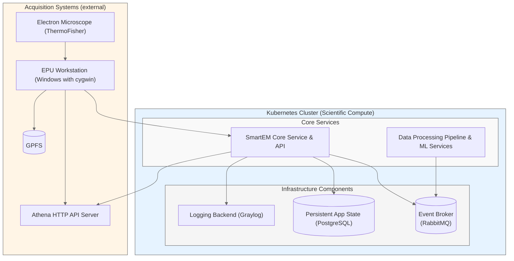

[](
https://github.com/DiamondLightSource/smartem-decisions/actions/workflows/ci.yml)
[](
https://codecov.io/gh/DiamondLightSource/smartem-decisions)
[](https://opensource.org/licenses/Apache-2.0)

# SmartEM Decisions

A comprehensive system for smart data collection and processing in cryo-electron microscopy, designed to optimize
acquisition workflows through intelligent decision-making and real-time data analysis.

## Quick Links

Source          | <https://github.com/DiamondLightSource/smartem-decisions>
:---:           | :---:
Docker          | `docker run ghcr.io/DiamondLightSource/smartem-backend:latest`
Documentation   | <https://DiamondLightSource.github.io/smartem-decisions>
Releases        | <https://github.com/DiamondLightSource/smartem-decisions/releases>
Project Board   | <https://github.com/orgs/DiamondLightSource/projects/33/views/1>
Test Datasets   | <https://gitlab.diamond.ac.uk/scisoft/cryoem/smartem-decisions-test-datasets>

## System Components

- **`smartem_common`**: Shared schemas, types, and utilities used across all components
- **`smartem_backend`**: Core backend service with HTTP API, database operations, and message queue processing
- **`smartem_agent`**: Data collection agent that monitors EPU output and communicates with backend
- **`athena_api`**: Athena HTTP API server integration

## Quick Start

```python
from smartem_backend._version import __version__

print(f"Hello smartem_backend {__version__}")
```

## Architecture Overview



## Development Setup

```bash
# venv and requirements
python -m venv .venv
source .venv/bin/activate
pip install -e .[dev] # or .[backend] for production

# Start services with verbosity controls:
python -m smartem_backend.run_api -v               # HTTP API with INFO logging
python -m smartem_backend.consumer -v           # Message queue consumer with INFO logging  
python -m smartem_agent watch /path/to/data -v     # File watcher with INFO logging

# For testing file watcher with simulated EPU data:
python tools/fsrecorder/fsrecorder.py replay recording.tar.gz /path/to/data --fast
```

## Administrative Utilities

After installation with `pip install -e .[all]`, the following command-line utilities are available for system administration and maintenance:

### Agent Communication Management

- **`smartem.agent-cleanup`** - Data lifecycle and cleanup operations for agent communication data
  ```bash
  # Check current database usage and statistics
  smartem.agent-cleanup --operation=stats
  
  # Run full cleanup with scientific retention policy (7-year audit trail)
  smartem.agent-cleanup --operation=cleanup --policy=scientific
  
  # Run cleanup with development retention policy (shorter retention)
  smartem.agent-cleanup --operation=cleanup --policy=development
  
  # Clean only stale connections
  smartem.agent-cleanup --operation=connections
  
  # Preview what would be cleaned without making changes
  smartem.agent-cleanup --operation=cleanup --dry-run
  ```

### ML Model and Prediction Management

- **`smartem.register-prediction-model`** - Register new machine learning prediction models
  ```bash
  smartem.register-prediction-model "ResNet-50" "Deep learning model for cryo-EM image quality assessment"
  ```

- **`smartem.init-model-weight`** - Initialize model weights for specific grids
  ```bash
  smartem.init-model-weight --help  # View available options
  ```

- **`smartem.random-model-predictions`** - Generate test predictions for development and testing
  ```bash
  smartem.random-model-predictions --help  # View available options
  ```

- **`smartem.random-prior-updates`** - Simulate prior updates for testing workflows
  ```bash
  smartem.random-prior-updates --help  # View available options
  ```

### Development and Integration Tools

- **`smartem_agent_tools`** - Agent development and debugging utilities
- **`smartem-mcp`** - Model Context Protocol (MCP) integration tools

### Data Retention Policies

The `smartem.agent-cleanup` utility supports two built-in retention policies:

- **Scientific Compliance** (default): Conservative retention suitable for scientific research
  - Connections: 48 hours
  - Instructions: 365 days  
  - Completed sessions: 2 years
  - Acknowledgements: 7 years (regulatory compliance)

- **Development**: Shorter retention for development environments
  - Connections: 4 hours
  - Instructions: 7 days
  - Completed sessions: 14 days
  - Acknowledgements: 30 days

All utilities include comprehensive `--help` documentation for detailed usage instructions.

## More Information

For detailed documentation including:

- [Logging Configuration](docs/how-to/configure-logging.md)
- [Running Backend Services](docs/how-to/run-backend.md)
- [Running Agent Services](docs/how-to/run-agent.md)
- [EPU Data Structure Explanations](docs/explanations/epu-data-structures.md)
- [Kubernetes Deployment](docs/how-to/deploy-kubernetes.md)
- [Development Tools](docs/how-to/development-tools.md)
- And more...

See https://DiamondLightSource.github.io/smartem-decisions for complete documentation.
