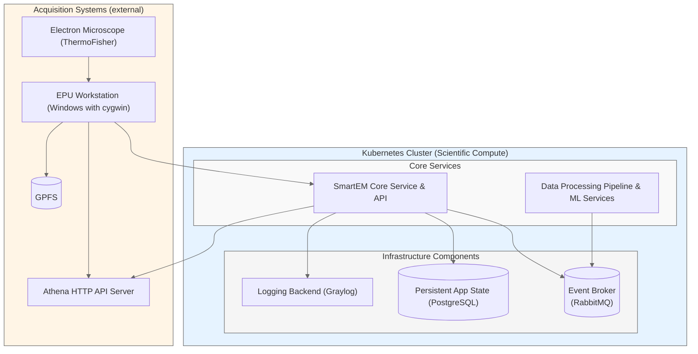

[](
https://github.com/DiamondLightSource/smartem-decisions/actions/workflows/ci.yml)
[](
https://codecov.io/gh/DiamondLightSource/smartem-decisions)
[](https://opensource.org/licenses/Apache-2.0)

# SmartEM Decisions

A comprehensive system for smart data collection and processing in cryo-electron microscopy, designed to optimize
acquisition workflows through intelligent decision-making and real-time data analysis.

## Quick Links

Source          | <https://github.com/DiamondLightSource/smartem-decisions>
:---:           | :---:
Docker          | `docker run ghcr.io/DiamondLightSource/smartem-backend:latest`
Documentation   | <https://DiamondLightSource.github.io/smartem-decisions>
Releases        | <https://github.com/DiamondLightSource/smartem-decisions/releases>
Project Board   | <https://github.com/orgs/DiamondLightSource/projects/33/views/1>
Test Datasets   | <https://gitlab.diamond.ac.uk/scisoft/cryoem/smartem-decisions-test-datasets>

## System Components

- **`smartem_common`**: Shared schemas, types, and utilities used across all components
- **`smartem_backend`**: Core backend service with HTTP API, database operations, and message queue processing
- **`smartem_agent`**: Data collection agent that monitors EPU output and communicates with backend
- **`athena_api`**: Athena HTTP API server integration

## Quick Start

```python
from smartem_backend._version import __version__

print(f"Hello smartem_backend {__version__}")
```

## Architecture Overview



## Development Setup

```bash
# venv and requirements
python -m venv .venv
source .venv/bin/activate
pip install -e .[dev] # or .[backend] for production

# Start services with verbosity controls:
python -m smartem_backend.run_api -v               # HTTP API with INFO logging
python -m smartem_backend.consumer -v           # Message queue consumer with INFO logging  
python -m smartem_agent watch /path/to/data -v     # File watcher with INFO logging

# For testing file watcher with simulated EPU data:
python tools/fsrecorder/fsrecorder.py replay recording.tar.gz /path/to/data --fast
```

## More Information

For detailed documentation including:

- [Logging Configuration](docs/how-to/configure-logging.md)
- [Running Backend Services](docs/how-to/run-backend.md)
- [Running Agent Services](docs/how-to/run-agent.md)
- [EPU Data Structure Explanations](docs/explanations/epu-data-structures.md)
- [Kubernetes Deployment](docs/how-to/deploy-kubernetes.md)
- [Development Tools](docs/how-to/development-tools.md)
- And more...

See https://DiamondLightSource.github.io/smartem-decisions for complete documentation.
