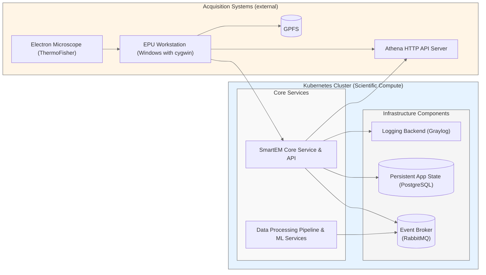

[](https://github.com/DiamondLightSource/smartem-decisions/actions/workflows/ci.yml)
[](https://codecov.io/gh/DiamondLightSource/smartem-decisions)

[](https://opensource.org/licenses/Apache-2.0)

# smartem_decisions

Project board: <https://github.com/orgs/DiamondLightSource/projects/33/views/1>

This is where you should write a short paragraph that describes what your module does,
how it does it, and why people should use it.

Source          | <https://github.com/DiamondLightSource/smartem-decisions>
:---:           | :---:
Docker          | `docker run ghcr.io/DiamondLightSource/smartem-decisions:latest`
Documentation   | <https://DiamondLightSource.github.io/smartem-decisions>
Releases        | <https://github.com/DiamondLightSource/smartem-decisions/releases>

This is where you should put some images or code snippets that illustrate
some relevant examples. If it is a library then you might put some
introductory code here:

```python
from smartem_decisions import __version__

print(f"Hello smartem_decisions {__version__}")
```

Or if it is a commandline tool then you might put some example commands here:

<!-- README only content. Anything below this line won't be included in index.md -->

See https://DiamondLightSource.github.io/smartem-decisions for more detailed documentation.

## Architectural Overview



## Running in development

```bash
# venv and requirements
python -m venv .venv
source .venv/bin/activate
pip install -r dev-requirements.txt # or should it be done using poetry and .pyproject.toml?

# create env and launch service stack locally:
cp .env.example .env
docker compose up -d

# launch RabbitMQ worker (consumer)
python src/smartem_decisions/consumer.py

# simulating an system event: 
./src/smartem_decisions/simulate_msg.py --help # to see list of options
./tools/simulate-messages.sh # run a simulation, triggering system events in sequence

# to install fastapi CLI: `pip install "fastapi[standard]"`
fastapi dev src/smartem_decisions/http_api.py # run HTTP API in development
source .env && uvicorn src.smartem_decisions.http_api:app --host 0.0.0.0 --port $HTTP_API_PORT # run HTTP API in  production

python -m smartem_decisions --version

# podman image/container operations:
podman build --format docker . -t smartem_decisions # build image
podman run -p 8000:8000 localhost/smartem_decisions # run container
podman image rm localhost/smartem_decisions -f # clean up before rebuild
```

## Notes

- mock the decision-making stuff
  - to be tackled separately
  - to be decoupled and modular, so we can easily swap out decision-making authorities in the future
- communicate decisions to cryoEM controller API (TBC naming!)
- https://github.com/DiamondLightSource/ispyb-database is a database schema that stores information about 
  what is run, metadata, how many images, sample type etc.
- for context:
  - https://www.ncbi.nlm.nih.gov/pmc/articles/PMC10910546/,
    https://www.ncbi.nlm.nih.gov/pmc/articles/PMC10910546/pdf/d-80-00174.pdf
  - https://www.biorxiv.org/content/10.1101/2024.02.12.579963v1,
    https://www.biorxiv.org/content/10.1101/2024.02.12.579963v1.full.pdf
- initially the process produces stuff on the filesystem similar to this example: `doc/metadata_spa_acquisition`
- parts of the current **Data Processing Pipeline**:
  - particle picking service receives a JSON blob via RabitMQ, is given a path to an image, picks on that and produces
    a list of coordinates of particles on that image:
    https://github.com/DiamondLightSource/cryoem-services/blob/main/src/cryoemservices/services/cryolo.py
  - particle filtering service: https://github.com/DiamondLightSource/cryoem-services/blob/main/src/cryoemservices/services/select_particles.py
