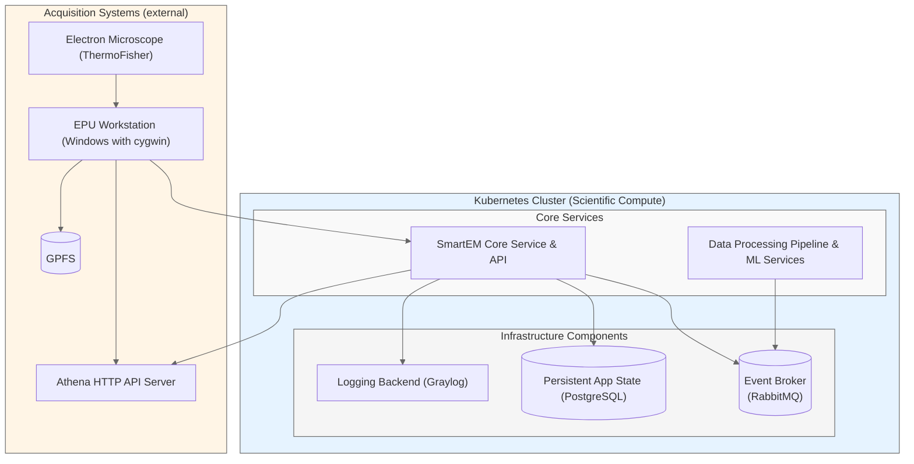

[](https://github.com/DiamondLightSource/smartem-decisions/actions/workflows/ci.yml)
[](https://codecov.io/gh/DiamondLightSource/smartem-decisions)
[](https://opensource.org/licenses/Apache-2.0)

# SmartEM Decisions

A comprehensive system for smart data collection and processing in cryo-electron microscopy, designed to optimize acquisition workflows through intelligent decision-making and real-time data analysis.

## System Components

- **`smartem_common`**: Shared schemas, types, and utilities used across all components
- **`smartem_api`**: HTTP API client and server functionality for component communication  
- **`smartem_backend`**: Core backend service with database operations and message queue processing
- **`smartem_agent`**: Data collection agent that monitors EPU output and communicates with backend

- Project board: <https://github.com/orgs/DiamondLightSource/projects/33/views/1>
- Test Datasets: https://gitlab.diamond.ac.uk/scisoft/cryoem/smartem-decisions-test-datasets

Source          | <https://github.com/DiamondLightSource/smartem-decisions>
:---:           | :---:
Docker          | `docker run ghcr.io/DiamondLightSource/smartem-backend:latest`
Documentation   | <https://DiamondLightSource.github.io/smartem-decisions>
Releases        | <https://github.com/DiamondLightSource/smartem-decisions/releases>

## Quick Start

```python
from smartem_backend._version import __version__

print(f"Hello smartem_backend {__version__}")
```

## Architecture Overview



## Development Setup

```bash
# venv and requirements
python -m venv .venv
source .venv/bin/activate
pip install -e .[dev] # or .[backend] for production

# Start services with verbosity controls:
python -m smartem_backend.run_api -v               # HTTP API with INFO logging
python -m smartem_backend.consumer -v           # Message queue consumer with INFO logging  
python -m smartem_agent watch /path/to/data -v     # File watcher with INFO logging

# For testing file watcher with simulated EPU data:
python tools/fsrecorder/fsrecorder.py replay recording.tar.gz /path/to/data --fast
```

## Verbosity Control

All SmartEM Backend services support configurable logging levels to help with debugging and reduce noise in production environments.

### Command Line Verbosity

Use the `-v` and `-vv` flags to control verbosity:

```bash
# ERROR level only (default - minimal output)
python -m smartem_backend.consumer
python -m smartem_backend.run_api
python -m smartem_agent watch /path/to/data

# INFO level and above (-v flag)
python -m smartem_backend.consumer -v
python -m smartem_backend.run_api -v
python -m smartem_agent watch /path/to/data -v

# DEBUG level and above (-vv flag - most verbose)
python -m smartem_backend.consumer -vv
python -m smartem_backend.run_api -vv
python -m smartem_agent watch /path/to/data -vv
```

### Environment Variable Control

For the HTTP API, you can also control logging via environment variables:

```bash
# Set log level via environment variable (equivalent to -v/-vv flags)
SMARTEM_LOG_LEVEL=ERROR python -m smartem_backend.run_api
SMARTEM_LOG_LEVEL=INFO python -m smartem_backend.run_api 
SMARTEM_LOG_LEVEL=DEBUG python -m smartem_backend.run_api
```

### Log Levels

- **ERROR** (default): Only critical errors are shown
- **INFO** (`-v`): Informational messages, warnings, and errors
- **DEBUG** (`-vv`): All messages including detailed debugging information

This verbosity control helps reduce log noise during normal operation while providing detailed output when troubleshooting issues.

---

# SmartEM Backend Module

The core backend service providing HTTP API, database operations, and message queue processing for intelligent cryo-EM data collection.

## Backend Operations

```bash
# create env and launch service stack locally:
./tools/dev-k8s.sh up

# launch RabbitMQ worker (consumer)
python -m smartem_backend.consumer              # ERROR level (default)
python -m smartem_backend.consumer -v           # INFO level  
python -m smartem_backend.consumer -vv          # DEBUG level

# simulating an system event: 
python -m smartem_backend.simulate_msg --help # to see a list of options
./tools/simulate-messages.sh # run a simulation, triggering system events in sequence

# run HTTP API with verbosity controls:
python -m smartem_backend.run_api                  # ERROR level (default)
python -m smartem_backend.run_api -v               # INFO level
python -m smartem_backend.run_api -vv              # DEBUG level

# run HTTP API in development (FastAPI CLI):
fastapi dev src/smartem_backend/http_api.py # Note: FastAPI CLI gets installed by pip as one of dev dependencies
# run HTTP API in production (traditional):
source .env && uvicorn src.smartem_backend.http_api:app --host 0.0.0.0 --port $HTTP_API_PORT
# run HTTP API with environment variable:
SMARTEM_LOG_LEVEL=ERROR uvicorn src.smartem_backend.http_api:app --host 0.0.0.0 --port $HTTP_API_PORT
# smoke test the API:
./tests/check_smartem_core_http_api.py http://localhost:8000 -v

python -m smartem_backend --version
```

---

# SmartEM Agent (EPU Agent)

The data collection agent that monitors EPU output directories and communicates acquisition data to the backend service.

The EPU agent runs on EPU workstations either as a Python script or bundled Windows binary. EPU workstations are Windows machines isolated from the main network, where specific connectivity is achieved through a proxy and configured via an allow-list. The primary purpose of the EPU agent is to parse EPU software output from the filesystem and communicate data and events to the core backend component.

An EPU data directory is generated by closed-source EPU software and represents an acquisition session using a cryo-electron microscope. The agent can:

- Parse data out of specific types of files typically found in EPU directories
- Validate a finished EPU directory for correct structure and completeness
- Parse out complete acquisition dataset from a finished EPU directory
- Parse out incomplete acquisition dataset from an unfinished EPU directory
- Run in filesystem watcher mode to incrementally update the acquisition dataset as EPU directory is written to
- Run in **default mode** - combining the above to make it safe starting the data intake at any point in relation to EPU execution

## Agent Parse and Validate Operations

```bash
# parse complete EPU directory
python -m smartem_agent parse dir \
  ../smartem-decisions-test-datasets/metadata_Supervisor_20250108_101446_62_cm40593-1_EPU

python -m smartem_agent parse dir \
  ../smartem-decisions-test-datasets/metadata_Supervisor_20250114_220855_23_epuBSAd20_GrOxDDM

python -m smartem_agent parse dir \
  ../smartem-decisions-test-datasets/metadata_Supervisor_20241220_140307_72_et2_gangshun

# parse things
python -m smartem_agent parse session \
  ../smartem-decisions-test-datasets/bi37708-28-copy/Supervisor_20250129_134723_36_bi37708-28_grid7_EPU/EpuSession.dm

python -m smartem_agent parse atlas \
  ../smartem-decisions-test-datasets/bi37708-28-copy/atlas/Supervisor_20250129_111544_bi37708-28_atlas/Atlas/Atlas.dm

python -m smartem_agent parse gridsquare \
  ../smartem-decisions-test-datasets/epu-Supervisor_20250404_164354_31_EPU_nr27313-442/metadata_Supervisor_20250404_164354_31_EPU_nr27313-442/Images-Disc1/GridSquare_3568837/GridSquare_20250404_171012.xml

python -m smartem_agent parse gridsquare-metadata \
  ../smartem-decisions-test-datasets/epu-Supervisor_20250404_164354_31_EPU_nr27313-442/metadata_Supervisor_20250404_164354_31_EPU_nr27313-442/Metadata/GridSquare_3568837.dm

python -m smartem_agent parse gridsquare-metadata \
  ./tests/testdata/bi37708-28/Supervisor_20250129_134723_36_bi37708-28_grid7_EPU/Metadata/GridSquare_29273435.dm

python -m smartem_agent parse foilhole \
  tests/testdata/epu-dir-example/Images-Disc1/GridSquare_8999138/FoilHoles/FoilHole_9015889_20250108_154725.xml

python -m smartem_agent parse gridsquare-metadata \
  ../smartem-decisions-test-datasets/epu-Supervisor_20250404_164354_31_EPU_nr27313-442/metadata_Supervisor_20250404_164354_31_EPU_nr27313-442/Images-Disc1/GridSquare_3568837/Data/FoilHole_3595930_Data_3590445_56_20250405_084025.xml

# Validate epu project dirs (expect failure):
python -m smartem_agent validate \
  ../smartem-decisions-test-datasets/bi37708-28-copy/Supervisor_20250129_114842_73_bi37708-28_grid7_EPU

python -m smartem_agent validate \
  ../smartem-decisions-test-datasets/bi37708-28-copy/Supervisor_20250130_105058_11

python -m smartem_agent validate \
  ../smartem-decisions-test-datasets/bi37708-28-copy/Supervisor_20250130_145409_68

python -m smartem_agent validate \
  ../smartem-decisions-test-datasets/bi37708-28-copy/Supervisor_20250130_150924_1grid3

# Validate epu project dirs (expect success):
python -m smartem_agent validate \
  ../smartem-decisions-test-datasets/bi37708-28-copy/Supervisor_20250129_134723_36_bi37708-28_grid7_EPU

python -m smartem_agent validate \
  ../smartem-decisions-test-datasets/bi37708-28-copy/Supervisor_20250130_133418_68apoferritin

python -m smartem_agent validate \
  ../smartem-decisions-test-datasets/bi37708-28-copy/Supervisor_20250130_143856_44Practice

python -m smartem_agent validate \
  ../smartem-decisions-test-datasets/bi37708-28-copy/Supervisor_20250130_145409_68practice2
```

## Agent Watch Operations

The agent monitors EPU output directories for changes:

```bash
# Launch the watcher:
python -m smartem_agent watch ../test-dir --log-file output.log

# For testing incremental file writes, use the fsrecorder tool to simulate EPU behavior:
# First, record from an existing EPU dataset:
python tools/fsrecorder/fsrecorder.py record ../smartem-decisions-test-datasets/epu-Supervisor_20250326_145351_30_nt33824-10_grid2_1in5dil ../test-recording.tar.gz

# Then replay it to your test directory with accelerated timing:
python tools/fsrecorder/fsrecorder.py replay ../test-recording.tar.gz ../test-dir --fast

# Alternatively, for quick testing, copy data manually:
cp -r "../smartem-decisions-test-datasets/epu-Supervisor_20250326_145351_30_nt33824-10_grid2_1in5dil/"* ../test-dir/
```

> **Note**: The fsrecorder tool (`tools/fsrecorder/`) provides accurate simulation of EPU file writing patterns with proper timing and ordering.
> The absence of `EpuSession.dm` file is pretty much a show-stopper as it provides references to atlas and is a trigger
> for instantiating a new grid entity in the internal datastore.

A `watch` operation is designed to gracefully handle one of the following invocation scenarios:

1. watcher launched _before_ EPU starts writing to filesystem - only watcher is necessary
2. watcher launched _after_ EPU starts writing to filesystem - both parser and watcher are
   necessary to pickup pre-existing and new writes
3. watcher launched _after_ EPU _finishes_ writing to filesystem - only parser is necessary

## EPU Output Directory Structure

> Directory layout on the EPU machine will differ from the layout of that
> same directory synced to file storage. Layout relevant to epu data intake component
> is as it appears on the EPU machines, where the watcher runs.

In a user visit there can be more than one `EpuSession.dm` and more than one "project dir"
as there will be one for each grid. We usually treat each `EpuSession.dm` independently,
but they all connect to the same atlas.

```
grid-data-dir-structure-example
├── EpuSession.dm
├── Images-Disc1
│  ├── GridSquare_8999138
│  │  ├── Data
│  │  │  ├── FoilHole_9015883_Data_9017347_6_20250108_154915.jpg
│  │  │  ├── FoilHole_9015883_Data_9017347_6_20250108_154915.xml
│  │  │  ├── FoilHole_9015883_Data_9017354_6_20250108_154918.jpg
│  │  │  └── FoilHole_9015883_Data_9017354_6_20250108_154918.xml
│  │  ├── FoilHoles
│  │  │  ├── FoilHole_9015889_20250108_154715.jpg
│  │  │  ├── FoilHole_9015889_20250108_154715.xml
│  │  │  ├── FoilHole_9015889_20250108_154725.jpg
│  │  │  └── FoilHole_9015889_20250108_154725.xml
│  │  ├── GridSquare_20250108_151151.jpg
│  │  └── GridSquare_20250108_151151.xml
│  └── GridSquare_8999186
│      ├── Data
│      │  ├── FoilHole_9028219_Data_9017347_50_20250109_062621.jpg
│      │  ├── FoilHole_9028219_Data_9017347_50_20250109_062621.xml
│      │  ├── FoilHole_9028219_Data_9017354_50_20250109_062624.jpg
│      │  └── FoilHole_9028219_Data_9017354_50_20250109_062624.xml
│      ├── FoilHoles
│      │  ├── FoilHole_9028276_20250109_061712.jpg
│      │  ├── FoilHole_9028276_20250109_061712.xml
│      │  ├── FoilHole_9028276_20250109_061722.jpg
│      │  ├── FoilHole_9028276_20250109_061722.xml
│      │  └── FoilHole_9028325_20250109_063110.jpg
│      ├── GridSquare_20250108_152955.jpg
│      └── GridSquare_20250108_152955.xml
└── Metadata
    ├── GridSquare_8999138.dm
    └── GridSquare_8999186.dm
```

### EPU Directory Structure Details

- An EPU directory consists of multiple subdirectories as well as `.xml`, `.dm` and `.jpg` files
  - Any `.dm` files are actually XML files
  - This directory is written to incrementally by EPU software, it does not materialise in a complete state right away
- An EPU directory will contain a file named `EpuSession.dm` at root level. Useful information contained in this file:
  - Session _name_, _id_ and _start time_;
  - fs path of the EPU directory;
  - A reference to `Atlas.dm` file (which resides outside the EPU directory);
  - _clustering_ mode and radius
- An `Atlas.dm` file contains general information about the acquisition session (which possibly duplicates info already
  found in `EpuSession.dm` and, crucially, information about _atlas tiles_
  - _Atlas tiles_ contain positioning information, which is needed to map physical positions on the grid (measured in
    number of turns of the actuator) to their pixel coordinates in image files
- An EPU directory will contain a subdirectory named `Metadata/` at root level
  - `Metadata` directory is flat and contains a large list of files all using a naming convention
    `GridSquare_<gridsquare_id>.dm`, for example: `GridSquare_8999138.dm`, `GridSquare_8999186.dm`
  - The `Metadata/` directory contains all grid squares not just the ones that are captured
  - Some `Metadata/GridSquare_<gridsquare_id>.dm` files will have a significantly larger file size than others.
    Those are the ones that were of interest and so further scans took place during the acquisition session
  - The rest of GridSquare files under `Metadata/` are typically around 2.8Kb in size
- An EPU directory contains at least one subdirectory named `Images-Disc1/` at root level,
  and it's possible to have multiple subdirectories with a naming convention `Images-Disc<int>`, though in most
  cases there will only be one.
  - An `Images-Disc<int>/` directory will contain a number of subdirectories following a naming convention
    `GridSquare_<gridsquare_id>/`, corresponding to GridSquare files in `Metadata/`, but only for GridSquares of
    interest where further scanning took place
- A GridSquare directory matching a glob `Images-Disc<int>/GridSquare_<gridsquare_id>/` will contain:
  - a GridSquare manifest file, such as `GridSquare_20250108_152955.xml`
  - **optionally** subdirectories `FoilHoles/` and `Data/`, containing FoilHole and Micrograph information, respectively

---

# Kubernetes Deployment

This directory contains Kubernetes deployment configurations for SmartEM Backend across different environments.

## Quick Start (Development)

For local development, use the convenient script that provides a docker-compose-like experience:

```bash
# Start the development environment (equivalent to docker-compose up -d)
./tools/dev-k8s.sh

# Check status (equivalent to docker ps)
./tools/dev-k8s.sh status

# View logs for a service
./tools/dev-k8s.sh logs smartem-http-api

# Stop the environment (equivalent to docker-compose down)
./tools/dev-k8s.sh down

# Restart everything
./tools/dev-k8s.sh restart

# Get help
./tools/dev-k8s.sh --help
```

### Access URLs
Once the environment is running, you can access:
- **📊 Adminer (Database UI)**: http://localhost:30808
- **🐰 RabbitMQ Management**: http://localhost:30673
- **📡 SmartEM Backend HTTP API**: http://localhost:30080/health
- **📚 API Documentation**: http://localhost:30080/docs

> **Note**: The script automatically handles GitHub Container Registry authentication and waits for all pods to be ready.

## Kubernetes Structure

```
k8s/
├── environments/
│   ├── development/          # Local development (k3s)
│   ├── staging/             # Staging environment (pollux)
│   └── production/          # Production environment (argos?)
└── README.md
```

For detailed Kubernetes deployment instructions, environment configurations, and troubleshooting, see the [k8s directory documentation](k8s/).

---

# Development Tools

Collection of utility tools for development, testing, and maintenance.

## Format XML to make it readable, recursively

```bash
# To reformat all `.xml` and `.dm` files in a given directory recursively, rewriting in-place
# from single-line to human-readable:
python tools/format_xml.py <some_dir> -r

# Multiple dirs:
python tools/format_xml.py -r \
  ../smartem-decisions-test-datasets/metadata_Supervisor_20250114_220855_23_epuBSAd20_GrOxDDM \
  ../smartem-decisions-test-datasets/metadata_Supervisor_20241220_140307_72_et2_gangshun \
  ../smartem-decisions-test-datasets/metadata_Supervisor_20250108_101446_62_cm40593-1_EPU

# For more options see:
python tools/format_xml.py --help
```

## Find all foilhole manifest duplicates in a directory, recursively

```bash
 
tools/find_foilhole_duplicates.py --help
# e.g.
tools/find_foilhole_duplicates.py ./tests/testdata/bi37708-28
```

## List all files matching glob recursively in descending order by file size:

```bash
# To find 
rg --files -g 'GridSquare_*.dm' ./tests/testdata/bi37708-28 \
  | xargs -d '\n' ls -lh | sort -k5 -rn | awk '{print $9, $5}'
```

## Clean up test datasets to reduce file size

```bash
# recursively find all distinct file extensions in directory
find . -type f |
  sed -E 's/.*\.([^.]+)$/\1/' |
  grep -v "/" |
  sort |
  uniq -c |
  sort -nr

# recursively empty all jpg, png, mrc files:
find . -type f \( -name "*.jpg" -o -name "*.png" -o -name "*.mrc" \) -exec truncate -s 0 {} \;
```

## Watch dir metrics (num of files and file size) as stuff is written to it

```bash
watch -n 1 'echo "Size: $(du -sh .)"; echo "Files: $(find . -type f | wc -l)"'
```

---

# Documentation Generation

```sh
tox -e docs
python -m http.server -d build/html
```

# Containerization

```bash
# podman image/container operations:
podman build --format docker . -t smartem_backend # build image
podman run -p 8000:8000 localhost/smartem_backend # run container (TODO debug Postgres connection)
podman image rm localhost/smartem_backend -f # clean up before rebuild

# TODO but we should push to Github not Gitlab
# Once built, tagging and pushing is done like so:
# Refs:
#  - https://confluence.diamond.ac.uk/display/CLOUD/Container+Registry
#  - https://dev-portal.diamond.ac.uk/guide/kubernetes/tutorials/containers/
podman tag 55646974a136 gcr.io/diamond-pubreg/smartem_backend/smartem_backend:latest
podman push gcr.io/diamond-pubreg/smartem_backend/smartem_backend:latest
```

# Technical Notes

> TODO recycle these to `docs/`

- The number of micrographs in a single foil hole will be typically between 4 and 10.
- The total number of micrographs collected from a grid is normally 10-50k.
- The number of particles picked is about 300 per micrograph.
- About half of those are selected and half rejected

- mock the decision-making stuff
  - to be tackled separately
  - to be decoupled and modular, so we can easily swap out decision-making authorities in the future
- communicate decisions to cryoEM controller API (TBC naming!)
- https://github.com/DiamondLightSource/ispyb-database is a database schema that stores information about 
  what is run, metadata, how many images, sample type etc.
- for context:
  - https://www.ncbi.nlm.nih.gov/pmc/articles/PMC10910546/,
    https://www.ncbi.nlm.nih.gov/pmc/articles/PMC10910546/pdf/d-80-00174.pdf
  - https://www.biorxiv.org/content/10.1101/2024.02.12.579963v1,
    https://www.biorxiv.org/content/10.1101/2024.02.12.579963v1.full.pdf
- initially the process produces stuff on the filesystem similar to this example: `doc/metadata_spa_acquisition`
- parts of the current **Data Processing Pipeline**:
  - particle picking service receives a JSON blob via RabitMQ, is given a path to an image, picks on that and produces
    a list of coordinates of particles on that image:
    https://github.com/DiamondLightSource/cryoem-services/blob/main/src/cryoemservices/services/cryolo.py
  - particle filtering service: https://github.com/DiamondLightSource/cryoem-services/blob/main/src/cryoemservices/services/select_particles.py

<!-- README only content. Anything below this line won't be included in index.md -->

See https://DiamondLightSource.github.io/smartem-decisions for more detailed documentation.
